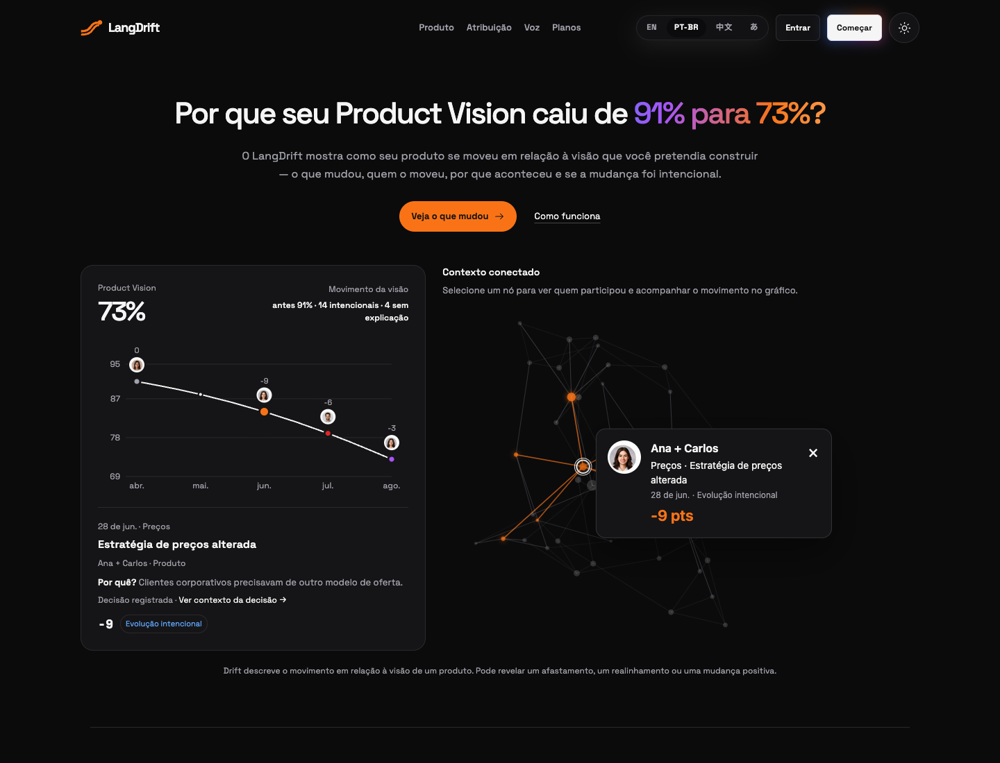

# LangDrift

### Your product moves fast. Know where it’s going.

Visual product intelligence for founders and teams building with humans and AI.

**Vision → Loop → Evidence**

[Explore LangDrift](https://langdrift.md/) · [SDK](https://github.com/gojhonny/langdrift/blob/staging/packages/sdk/README.md) · [Contribute](https://github.com/gojhonny/langdrift/issues)

Product preview · Illustrative data

## Every release changes your product. Keep the why.

Priorities shift. Customer requests reshape the roadmap. Humans and AI agents turn decisions into shipped changes. Over time, the product you build can move away from the one you intended.

LangDrift connects that movement to its context: **what changed, why it happened, who was involved, and whether it was intentional.**

- **See the direction.** Follow product evolution against your original vision.
- **Understand the trade-offs.** Connect changes to decisions and supporting evidence.
- **Keep accountability clear.** Trace contributions across people, teams, and agents.
- **Invest with context.** Revisit compromises and recognize opportunities before the next release.

## Vision → Loop → Evidence

| Vision                           | Loop                                            | Evidence                                       |
| -------------------------------- | ----------------------------------------------- | ---------------------------------------------- |
| Define what you want to achieve. | Follow the decisions and changes that shape it. | Understand what happened and what supports it. |

**Drift can reveal a gap, a deliberate trade-off, or a better direction.** Its meaning comes from context and evidence.

## Built for clearer product decisions

Visual-first for understanding. Voice-first for inquiry. One product story, from the original intent to the decisions that come next.

**[Explore the interactive demo →](https://langdrift.md/)**

In active development. The website demonstrates the intended experience; live platform integrations and voice inquiry are not yet available. SDK and setup packages are implemented but unpublished.

---

**From vision to reality, and everything in between.**  
Made in Brazil · [Neongate AI](https://neongate.com.br/)