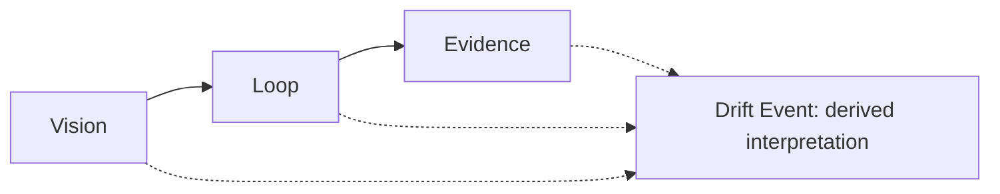

# Vision → Loop → Evidence

The LangDrift protocol has three pillars, in this order:

The solid path is the canonical model. The dotted inputs show the information
needed to interpret observed Loop movement as a Drift Event.

## Vision

Vision is the intended product direction. Protocol version 1 represents it
with three Markdown document families:

- `research`
- `prd`
- `context`

A Vision Target is an explicit identity used as the comparison target for a
Drift Event. The event stores that identity in `vision_target_id`.

## Loop

Loop is the work and decision cycle that follows intent. Its Markdown document
families are:

- `triage`
- `design-document`
- `spec`
- `ticket`

Observed movement comes from this cycle. The protocol connects artifacts
through explicit identifiers rather than inferring relationships from prose or
repository structure.

## Evidence

Evidence makes observations, decisions, and interpretations auditable. Its
document and event families are:

- `adr`
- `audit`
- `record`
- `drift`

A Record is a normalized observed fact. A Drift Event is a separate
interpretation of observed movement against a Vision Target, supported by
Evidence.

## Drift is derived

Drift is derived from the Loop; it is not a pillar and it is not automatically
negative. The Evidence schema stores Drift Event envelopes because their
references and reasoning must remain auditable.

`expected` means the movement matches recorded intent. `unexpected` means it
does not. Neither state says whether the movement is beneficial or harmful.

<Callout type="info">
**Concept.** Product Vision is an explainable, decomposable, auditable
executive state relative to recorded vision and decisions. The current SDK
does not define or calculate its formula.
</Callout>
