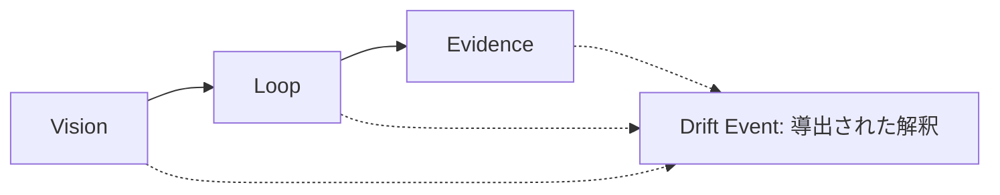

# Vision → Loop → Evidence

LangDrift プロトコルには、次の順序で 3 つの柱があります。

実線の経路が正規モデルです。点線の入力は、観測された Loop の動きを Drift Event として解釈するために必要な情報を示します。

## Vision

Vision は、意図した製品の方向性です。プロトコルバージョン 1 では、3 つの Markdown の文書ファミリーで表します。

- `research`
- `prd`
- `context`

Vision Target は、Drift Event の比較対象として使われる明示的な識別子です。イベントはその識別子を `vision_target_id` に格納します。

## Loop

Loop は、意図のあとに続く作業と意思決定のサイクルです。その Markdown の文書ファミリーは次のとおりです。

- `triage`
- `design-document`
- `spec`
- `ticket`

観測された動きは、このサイクルから得られます。プロトコルは、文章やリポジトリ構造から関係を推測せず、明示的な識別子を通じてアーティファクトを接続します。

## Evidence

Evidence は、観測、意思決定、解釈を監査可能にします。そのドキュメントとイベントのファミリーは次のとおりです。

- `adr`
- `audit`
- `record`
- `drift`

Record は、正規化された観測事実です。Drift Event は、Vision Target に対する観測された動きについて、Evidence に裏付けられた別個の解釈です。

## Drift は導出されます

Drift は Loop から導出されます。柱ではなく、自動的に否定的なものでもありません。Evidence スキーマが Drift Event のエンベロープを格納するのは、その参照と推論が監査可能なままである必要があるためです。

`expected` は、動きが記録された意図と一致することを意味します。`unexpected` は、一致しないことを意味します。どちらの状態も、その動きが有益か有害かを述べるものではありません。

<Callout type="info">
**概念。** Product Vision は、記録された Vision と意思決定に対する、説明可能で、分解可能で、監査可能な経営上の状態です。現在の SDK は、その計算式を定義も算出しもしません。
</Callout>
