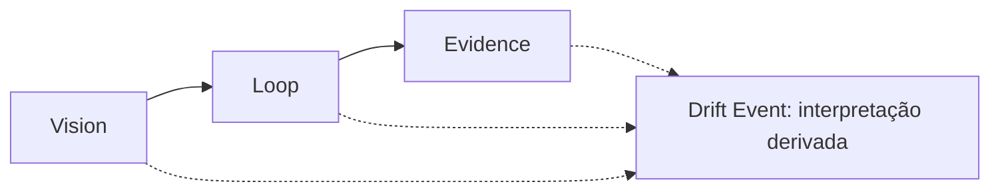

# Vision → Loop → Evidence

O protocolo LangDrift tem três pilares, nesta ordem:

O caminho de linha contínua é o modelo canônico. As ligações pontilhadas mostram a
informação necessária para interpretar o movimento observado do Loop como um
Drift Event.

## Vision

Vision é a direção pretendida do produto. A versão 1 do protocolo a representa
com três famílias de documentos Markdown:

- `research`
- `prd`
- `context`

Um Vision Target é uma identidade explícita usada como alvo de comparação de
um Drift Event. O evento armazena essa identidade em `vision_target_id`.

## Loop

Loop é o ciclo de trabalho e de decisão que segue a intenção. Suas famílias de
documentos Markdown são:

- `triage`
- `design-document`
- `spec`
- `ticket`

O movimento observado vem desse ciclo. O protocolo conecta artefatos por
identificadores explícitos, em vez de inferir relações a partir da prosa ou da
estrutura do repositório.

## Evidence

Evidence torna observações, decisões e interpretações auditáveis. Suas
famílias de documentos e de eventos são:

- `adr`
- `audit`
- `record`
- `drift`

Um Record é um fato observado normalizado. Um Drift Event é uma interpretação
separada do movimento observado em relação a um Vision Target, sustentada por
Evidence.

## O Drift é derivado

O Drift deriva do Loop; não é um pilar e não é automaticamente negativo. O
schema de Evidence armazena envelopes de Drift Event porque suas referências e
seu raciocínio precisam permanecer auditáveis.

`expected` significa que o movimento corresponde à intenção registrada.
`unexpected` significa que não corresponde. Nenhum dos dois estados indica se
o movimento é benéfico ou prejudicial.

<Callout type="info">
**Conceito.** Product Vision é um estado executivo explicável, decomponível e
auditável em relação à visão e às decisões registradas. O SDK atual não define
nem calcula essa fórmula.
</Callout>
