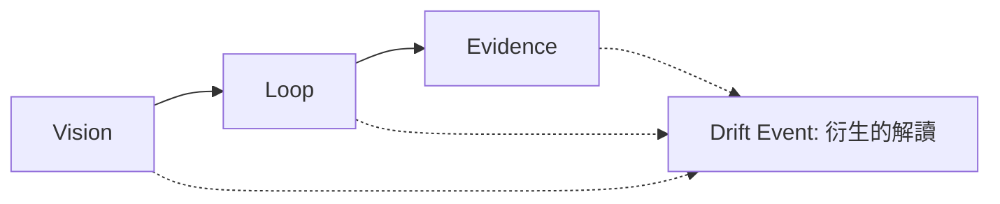

# Vision → Loop → Evidence

LangDrift 協定有三根支柱，順序如下：

實線路徑是標準模型。虛線輸入顯示把觀察到的 Loop 移動解讀為 Drift Event 所需的資訊。

## Vision

Vision 是預期的產品方向。協定版本 1 以三個 Markdown 文件家族表示它：

- `research`
- `prd`
- `context`

Vision 目標是明確的身分，用來作為 Drift Event 的比較目標。該事件把這個身分存在 `vision_target_id`。

## Loop

Loop 是跟隨意圖而來的工作與決策循環。它的 Markdown 文件家族是：

- `triage`
- `design-document`
- `spec`
- `ticket`

觀察到的移動來自這個循環。協定透過明確識別碼連接產物，而不是從散文或儲存庫結構推斷關係。

## Evidence

Evidence 讓觀察、決策與解讀可以被稽核。它的文件與事件家族是：

- `adr`
- `audit`
- `record`
- `drift`

Record 是一筆正規化的觀察事實。Drift Event 是另一項解讀，對照 Vision 目標解釋觀察到的移動，並由 Evidence 支持。

## Drift 是衍生的

Drift 由 Loop 衍生而來；它不是支柱，也不自動代表負面。Evidence 結構描述儲存 Drift Event 封套，因為它們的參照與推理必須保持可稽核。

`expected` 表示移動符合已記錄的意圖。`unexpected` 表示不符合。兩種狀態都不說明移動是有益或有害。

<Callout type="info">
**概念。** Product Vision 是相對於已記錄願景與決策、可解釋、可分解、可稽核的管理層狀態。目前的 SDK 不定義也不計算其公式。
</Callout>
